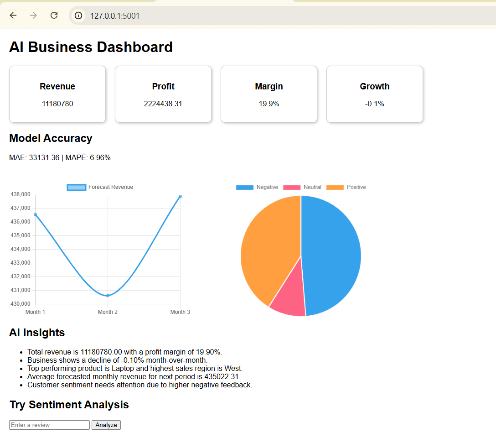

\# AI Business Dashboard with Forecasting \& NLP Insights


\## Project Overview


AI Business Dashboard is a Flask-based business analytics application that analyzes sales and customer review data to provide useful business insights.


The system combines data cleaning, KPI analysis, sales forecasting, and NLP-based sentiment analysis in a single dashboard.


\## Key Features


\- Sales data analysis

\- Data cleaning and preprocessing

\- Business KPI calculation

\- Revenue and profit analysis

\- Month-over-Month growth analysis

\- Top product and region identification

\- Sales forecasting using ARIMA

\- Forecast evaluation using MAE and MAPE

\- Customer review sentiment analysis

\- Positive, Negative, and Neutral sentiment classification

\- Automated business insights

\- Interactive web dashboard


\## Technologies Used


\- Python

\- Flask

\- Pandas

\- Statsmodels

\- Scikit-learn

\- NLTK

\- VADER Sentiment Analysis

\- HTML


\## Machine Learning \& NLP Techniques


\### Sales Forecasting


The project uses the ARIMA (AutoRegressive Integrated Moving Average) model to forecast future monthly sales.


\### Evaluation Metrics


The forecasting model is evaluated using:


\- Mean Absolute Error (MAE)

\- Mean Absolute Percentage Error (MAPE)


\### Sentiment Analysis


Customer reviews are analyzed using the VADER sentiment analysis technique.


The system classifies customer reviews into:


\- Positive

\- Negative

\- Neutral


\## Business KPIs


The dashboard calculates important business metrics such as:


\- Total Revenue

\- Total Profit

\- Profit Margin

\- Month-over-Month Growth

\- Top Performing Product

\- Highest Sales Region


\## Automated Business Insights


The system generates insights based on:


\- Revenue and profit performance

\- Monthly business growth

\- Top-performing products

\- Top-performing regions

\- Forecasted sales

\- Customer sentiment


\## Project Structure


```text

AI-Business-Dashboard-Forecasting-NLP/

│

├── backend/

│   ├── data_cleaning.py

│   ├── forecasting_engine.py

│   ├── insight_generator.py

│   ├── kpi_engine.py

│   └── nlp_engine.py

│

├── data/

│   ├── reviews_data.csv

│   └── sales_data.csv

│

├── templates/

│   └── dashboard.html

│

├── app.py

├── create_reviews_data.py

├── create_sales_data.py

├── test_forecast.py

├── test_insights.py

├── test_kpi.py

├── test_nlp.py

├── requirements.txt

├── .gitignore

└── README.md


## Installation

### 1. Clone the Repository

```bash
git clone https://github.com/gongatisravanireddy/AI-Business-Dashboard-Forecasting-NLP.git
```

### 2. Navigate to the Project Folder

```bash
cd AI-Business-Dashboard-Forecasting-NLP
```

### 3. Install Required Dependencies

```bash
pip install -r requirements.txt
```

### 4. Download VADER Lexicon

Open Python and run:

```python
import nltk
nltk.download('vader_lexicon')
```

## How to Run

Run the Flask application:

```bash
python app.py
```

The application will run at:

```text
http://127.0.0.1:5001
```

Open the above URL in your browser to view the dashboard.

## Dashboard Preview


